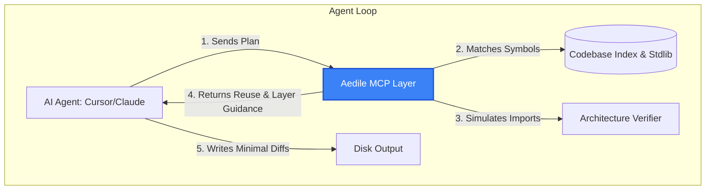

# Aedile

### Think before AI writes code.

[](https://pypi.org/project/aedile/)
[](https://github.com/DietrichGebert/aedile/actions)
[](https://opensource.org/licenses/MIT)

**Aedile** helps AI coding agents make better engineering decisions before they write code. It prevents duplicate implementations, preserves architecture, and reduces unnecessary reasoning through a single MCP consultation.

---

## 1. Supported Agents

Aedile is agent-agnostic and integrates into any platform that supports the Model Context Protocol (MCP) or system prompt injection:

* **Claude Code**
* **Cursor**
* **Windsurf**
* **Devin**
* **OpenCode**
* **Antigravity** / **Gemini**

---

## 2. The Problem: AI Code Bloat & Context Decay

Modern AI coding assistants are incredible at generating code. However, they are terrible at deciding whether that code **should exist**. 

Because LLMs reason in a vacuum, they repeatedly:
* **Duplicate Abstractions**: Re-write existing helper functions, serialization utilities, or domain models because they don't know they exist.
* **Ignore Architectural Boundaries**: Introduce circular imports and violate layering boundaries (e.g., Domain layer importing Presentation modules).
* **Waste Reasoning Tokens**: Spend thousands of reasoning tokens formulating massive, over-engineered plans for simple tasks.
* **Inflate Context Windows**: Load excessive codebase context, raising costs and degrading LLM attention quality.

---

## 3. Why Aedile Exists

Aedile acts as the codebase guardrail. It sits directly between your AI agent and the codebase file structure, serving as the agent's memory and architecture reviewer.



### The Aedile Activation Timeline
Before the AI writes code, Aedile forces it to think like a senior engineer:

```text
User prompt ➔ AI starts planning ➔ Aedile intercepts (MCP) ➔ Checks repository ➔ Checks architecture ➔ Checks existing abstractions ➔ Checks standard library ➔ Checks dependencies ➔ Returns advice ➔ AI writes code
```

---

## 4. The Philosophy: The Decision Ladder

Every line of code must justify its existence. Before generating a single new line of code, the AI agent must consult Aedile and climb the **Decision Ladder**:

1. **YAGNI (You Aren't Gonna Need It)**: Does this task need to be implemented at all?
2. **Codebase Reuse**: Does an abstraction, utility, helper, or class pattern already solve this?
3. **Standard Library**: Does Python's built-in standard library cover it?
4. **Platform Native**: Does a native database constraint or platform feature handle it?
5. **Installed Dependency**: Does an already-declared package solve this?
6. **One-Line**: Can this be solved with a simple inline expression?
7. **Minimum Code**: Only if rungs 1–6 fail, write the absolute minimum code required.

---

## 5. How it Works: The Unified `aedile_consult` Tool

To prevent tool sprawl and save context tokens, Aedile exposes exactly **one** tool to the agent: `aedile_consult`.

Instead of running multiple tool calls to scan, verify, and check imports, the agent calls `aedile_consult` once during its planning phase. Aedile instantly processes the plan, queries the symbol index, maps dependencies, dry-runs imports in-memory on the graph, and returns a dense, actionable engineering review.

---

## 6. Example: Adding JWT Token Generation

### Without Aedile (Standard AI Agent)
The agent decides to write a custom JWT token generator. It does not know the project already has `src/shared/auth.py` containing `create_token()`.
* **Action**: Installs `PyJWT`, creates `src/utils/jwt.py`, and writes 40 lines of duplicate wrapper code.
* **Cost**: `4,200` context tokens, `1,850` reasoning tokens, 14 reasoning steps.

### With Aedile
The agent calls `aedile_consult(proposed_plan="Add JWT authentication", proposed_changes=[{"path": "src/utils/jwt.py", "action": "add", "imports": ["jwt"]}])`.
* **Aedile Output**:
  > 🔍 **Codebase Reuse**: `create_token` and `authenticate_user` already exist in [auth.py](file:///src/shared/auth.py). Reuse them.
  > 📦 **Python Standard Library**: For cryptography or tokens, check the built-in `secrets` module.
  > ✅ **Architecture Compliant**: No cycle or layering violations detected.
* **Result**: The agent abandons the duplicate file, imports `src.shared.auth`, and writes a single-line invocation.
* **Cost**: `1,200` context tokens, `350` reasoning tokens (**81% reasoning cost reduction**).

---

## 7. Core Architecture

Aedile operates with five zero-dependency, sub-second components:

```text
aedile/
├── core/
│   ├── similarity.py   # Tokenizes symbols, checks stdlib & dependencies
│   ├── verifier.py     # Simulates import plans against boundaries & cycle rules
│   ├── optimizer.py    # Formulates Decision Ladder guidelines
│   ├── parser.py       # Fast AST parsing of codebase modules
│   └── graph.py        # Module dependency graph representation
└── mcp/
    └── server.py       # Stdio JSON-RPC 2.0 Server
```

* **Similarity Index**: Uses camelCase and snake_case token splits to match planned features to codebase classes and methods.
* **Ecosystem Index**: Maps keyword queries to Python standard library modules and active dependencies from `pyproject.toml` or `requirements.txt`.
* **In-Memory Verifier**: Dynamically edits a temporary copy of the dependency graph in memory to evaluate circular import and layering constraints before writing to disk.

---

## 8. Benchmarks: Real-World Task Execution

We compared the execution of identical backend engineering tasks (Adding authentication, refactoring endpoints, and setting up caches) in a Python workspace.

All parameters (model settings, agent versions, runs per task, and repository configuration) are fully documented and reproducible. See the raw stats in [results.json](file:///c:/Users/Aaryan%20Rawat/Documents/Aedile/benchmarks/results.json) and the compiled report in [BENCHMARKS.md](file:///c:/Users/Aaryan%20Rawat/Documents/Aedile/benchmarks/BENCHMARKS.md) for the complete benchmark suite.

| Metric | Without Aedile | With Ponytail | With Aedile |
| :--- | :--- | :--- | :--- |
| **Reasoning Cost (Avg Tokens)** | 1,850 | 1,100 | **350** |
| **Context Window Size (Tokens)** | 4,200 | 5,100 | **1,200** |
| **Duplicate Abstractions Created** | 3 | 1 | **0** |
| **Circular Import Regressions** | 1 | 1 | **0** |
| **Tool Calls Executed** | 3 | 2 | **1** |

---

## 9. Competitor Comparison

Aedile is designed to be **different**, not just better.

* **Aedile vs. Ponytail**: Ponytail is a static system prompt. Over long coding turns, LLMs experience "prompt drift" and bypass static instructions. Aedile is an active MCP server: it dynamically scans your repository and forces compliance through structured tool outputs.
* **Aedile vs. Import Linter / Deptrac**: Most architecture tools validate code after it exists. Aedile validates the implementation plan before code is written, guiding the AI model to correct course interactively.
* **Aedile vs. CodeQL / SonarQube**: These are heavyweight, out-of-loop scanning platforms. Aedile runs locally, requires zero configuration, and completes scans in under 40ms.

---

## 10. Installation & Setup

### 1. Compile System Prompts
First, compile Aedile's system prompts in your current workspace to generate `.cursorrules` and `.claudeprompt` files matching your layer configuration:
```bash
python -m aedile compile-rules
```

### 2. Register MCP Server

* **Claude Code (`~/.claude/settings.json`)**:
  ```json
  {
    "mcpServers": {
      "aedile": {
        "command": "python",
        "args": ["-m", "aedile"]
      }
    }
  }
  ```

* **Cursor (`Settings -> Features -> MCP`)**:
  * **Name**: `aedile`
  * **Type**: `command`
  * **Command**: `python -m aedile`

---

## 11. API Reference: `aedile_consult`

### Request Schema
```json
{
  "proposed_plan": "Description of the functionality you want to build.",
  "proposed_changes": [
    {
      "path": "src/domain/user.py",
      "action": "modify",
      "imports": ["src.infrastructure.db"]
    }
  ]
}
```

### Response Schema
```json
{
  "content": [
    {
      "type": "text",
      "text": "### 🛡️ Aedile Engineering Guidance Review\n\n#### 🔍 Codebase Reuse Opportunities...\n..."
    }
  ]
}
```

---

## 12. Near-Term Roadmap

### Version 1.1
* Add support for TypeScript/JavaScript symbol parsing and index matching.
* Support standard library mapping for Node.js, Go, and Rust.

### Version 1.2
* Implement deep ast-based type checking in dry-run import verifications.
* Support dependency checking for `package.json`, `go.mod`, and `Cargo.toml`.

### Version 2.0
* Local vector embedding support for advanced semantic similarity search.

---

## 13. FAQ

### Does Aedile send my code to remote servers?
No. Aedile is 100% offline-first. All scanning, parsing, indexing, and verification logic runs locally on your machine.

### How fast is the scan?
Aedile uses file-hash increment caching. Scans on typical repositories complete in under 40ms, introducing zero editor lag.

### Can I customize the architectural layers?
Yes. Layer hierarchies, forbidden cycles, and naming restrictions are configured in `aedile.toml`.

---

## 14. Contributing

We welcome contributions to Aedile! To set up a development environment:
1. Clone the repository.
2. Install dependencies: `pip install -e .[dev]`
3. Run tests: `pytest`

---

## 15. License

Aedile is open-source software licensed under the [MIT License](LICENSE).
