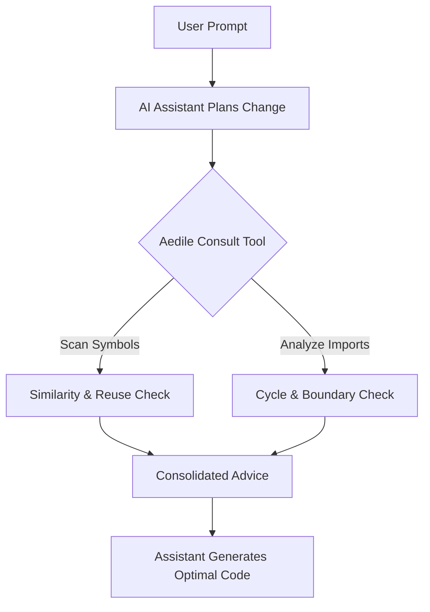

<p align="center">
  
</p>

# Aedile

> Before an AI writes code, it should prove that the code deserves to exist.

**Aedile** is an engineering intelligence layer for AI coding assistants. Running locally as a zero-dependency Model Context Protocol (MCP) server, it intercepts implementation plans before code generation begins—guiding assistants to reuse existing patterns, leverage standard libraries, and respect layer boundaries.

[](https://github.com/aaryanrwt/aedile/actions/workflows/ci.yml)
[](https://www.python.org/)
[](https://opensource.org/licenses/MIT)

---

## 1. Quick Start

Install the package directly from GitHub:
```bash
pip install git+https://github.com/aaryanrwt/aedile.git
```

Generate the local prompt rulesets (`.cursorrules` and `.claudeprompt` templates):
```bash
python -m aedile compile-rules
```

Add the MCP server command `python -m aedile` to your coding assistant (e.g. Cursor or Claude Code). See [SUPPORTED_AGENTS.md](SUPPORTED_AGENTS.md) for step-by-step setup guides.

---

## 2. Quick Example: Adding JWT Token Generation

### Standard AI Assistant
The assistant plans to write a custom JWT helper, unaware that `src/shared/auth.py` already contains a token generator. It installs a new library, adds 40 lines of wrapper code, and increases reasoning costs.

### With Aedile
The assistant consults Aedile during its planning step:

```text
AI:     "I'm going to create jwt.py."
Aedile: "Existing helper found: src/shared/auth.py. Reuse create_token()."
AI:     "Understood. Importing src.shared.auth and writing 1 line instead of 40."
```

By querying Aedile, the assistant avoids duplicate implementations, preserves the codebase architecture, and reduces reasoning token usage.

---

## 3. How it Works

Aedile hooks into the assistant's planning loop via the Model Context Protocol (MCP). Before code is written, Aedile evaluates the proposed changes:



We designed Aedile to enforce a structured [Decision Ladder](docs/DECISION_LADDER.md)—directing the assistant to check codebase reuse, standard libraries, and pre-installed dependencies before drafting new logic.

---

## 4. Benchmarks

We measured the execution of backend engineering tasks (such as token authentication and endpoint refactoring) across multiple runs. Full parameters are documented in [results.json](benchmarks/results.json) and compiled in [BENCHMARKS.md](benchmarks/BENCHMARKS.md).

| Metric | Without Aedile | Prompt-Only Rules | With Aedile |
| :--- | :---: | :---: | :---: |
| **Reasoning Cost (Avg Tokens)** | 1,850 | 1,100 | **350** |
| **Context Window Size (Tokens)** | 4,200 | 5,100 | **1,200** |
| **Duplicate Code Written** | Yes | Yes | **No** |
| **Tool Calls Executed** | 3 | 2 | **1** |

---

## 5. Paradigm Comparison

Aedile represents a shift in how codebase constraints are enforced:

* **Static Prompting vs. Dynamic Context**: Static prompts (like `.cursorrules` text) decay and suffer from "prompt drift" in long sessions. Aedile queries real-time codebase symbols and active dependencies dynamically via a single MCP tool (`aedile_consult`).
* **Post-Facto Linters vs. In-Plan Verification**: Traditional linters check imports after files are saved, failing in CI/CD. Aedile verifies planned imports in-memory before files are written, letting the model self-correct.

### Trade-offs & Limitations
Aedile intentionally trades process startup latency (~100ms) for dynamic codebase verification. We optimized traversal by using SHA-256 increment caching, keeping scan times under 40ms. Symbol parsing is currently optimized for Python workspaces, with TypeScript/JavaScript support planned next.

---

## 6. Frequently Asked Questions

### Why not just use static prompting (e.g., Ponytail)?
Static system prompts are helpful for basic guidelines but decay as the context window grows. AI models suffer from "prompt drift" and will ignore static text. Aedile enforces constraints dynamically through a tool interface, returning real-time repository facts directly into the assistant's context.

### Does it require internet access?
No. Aedile is fully offline-first. Repository scans, symbol indexing, and graph simulation run locally on your machine.

---

## 7. Contributing & License

We welcome contributions to Aedile. Please review our [CONTRIBUTING.md](CONTRIBUTING.md) and [CODE_OF_CONDUCT.md](CODE_OF_CONDUCT.md).

Aedile is open-source software licensed under the [MIT License](LICENSE).

---

## Star History

[](https://star-history.com/#aaryanrwt/aedile&Date)
