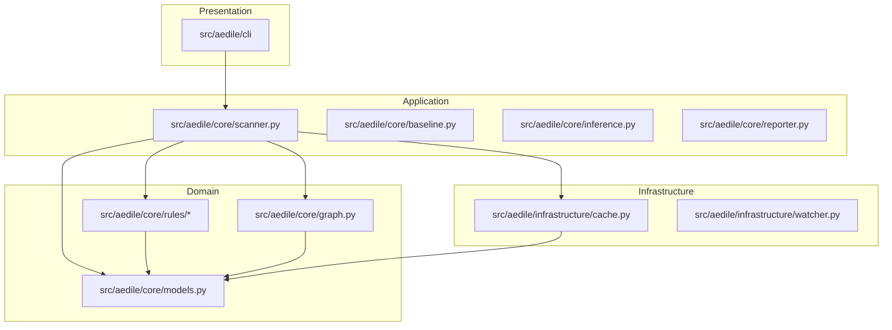

# Aedile Architecture

This document outlines the architectural guidelines and design principles of **Aedile**.

## Clean Architecture Principles

Aedile strictly enforces a clean architectural separation. Dependencies only flow inwards towards the Domain Layer, which has zero knowledge of the CLI, caching databases, or report templates.

### 1. Presentation Layer (`src/aedile/cli/`)
- Manages command-line argument parsing, options handling, and visual rendering to the stdout/stderr stream.
- Utilizes the `rich` console engine to output clean, interactive progress indicators and tables.
- **Rules**: Zero direct imports of parser instances or database caches; communicates exclusively with application runners.

### 2. Application Layer (`src/aedile/core/`)
- Coordinates the core business flows: scanning folders, matching rules, diffing baselines, and exporting reports.
- Handles parsing orchestration (`scanner.py`), baseline management (`baseline.py`), and configuration parsing.

### 3. Domain Layer (`src/aedile/core/models.py` & `src/aedile/core/graph.py` & `rules/`)
- Contains foundational business models (`SourceFile`, `Import`, `Symbol`, `Violation`).
- Houses the architectural dependency graph logic, containing cycle-finding algorithms (Tarjan's SCC) and layering validators.
- Enforces code metrics calculation (Architecture Risk Score).

### 4. Infrastructure Layer (`src/aedile/infrastructure/`)
- Interacts with OS-level interfaces: filesystem directory traversal, modification watches (`watcher.py`), and JSON/SQLite disk caching (`cache.py`).

---

## Data Flow: Scans

1. **CLI Trigger**: User calls `aedile check`.
2. **Setup**: The command handler initializes configuration TOML and disk caches.
3. **Traversal**: The `Scanner` crawls source directories, skipping items in exclude patterns.
4. **Hashing & Cache Query**: For each file, the scanner hashes contents. If the hash matches the cache, the scanner loads imports/symbols from disk. Otherwise, it triggers the AST parser and registers findings.
5. **Graph Construction**: The scanner creates an `ArchitectureGraph`, adding nodes for all discovered files and directed edges for internal module imports.
6. **Rule Checking**: The scanner feeds the graph and files into active rule engines (Cycle, Layer, Naming, etc.), producing `Violation` logs.
7. **Report Generation**: Outputs list of violations or fails build if regression occurs.
